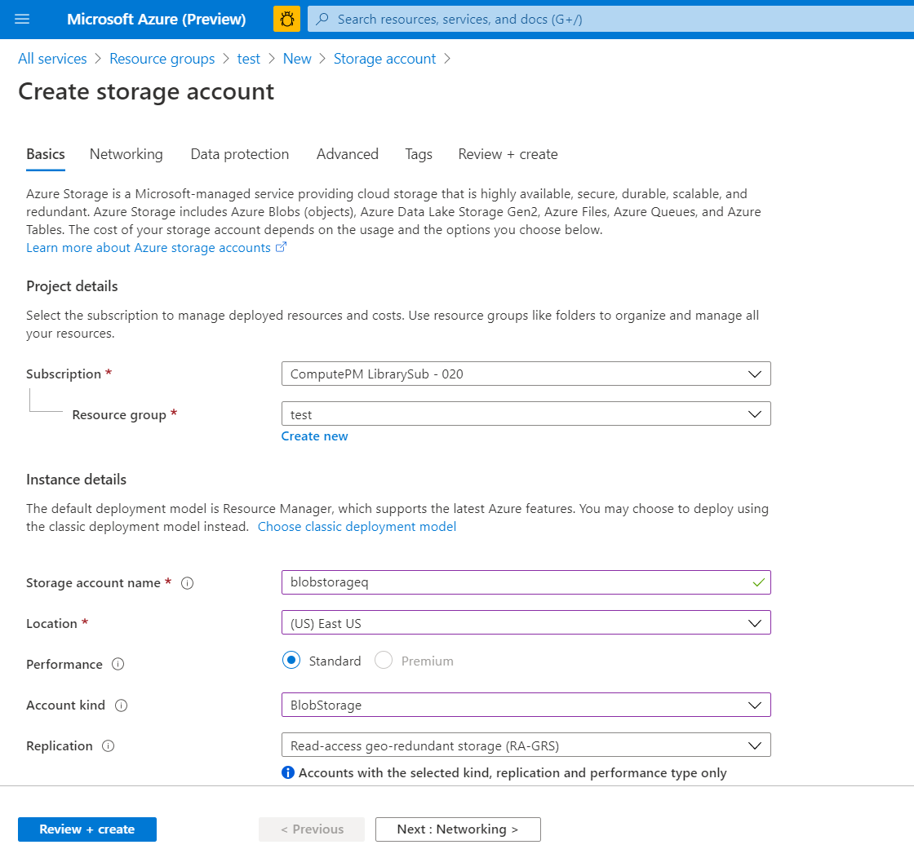
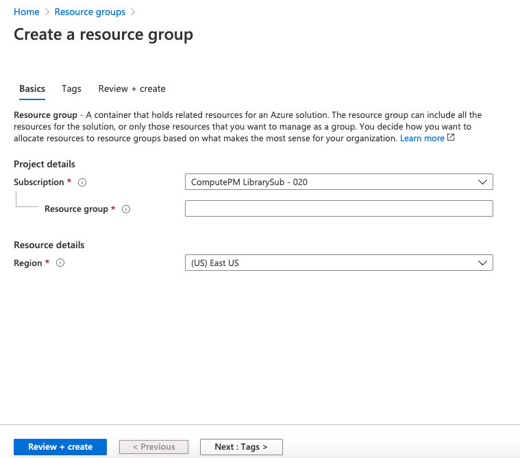
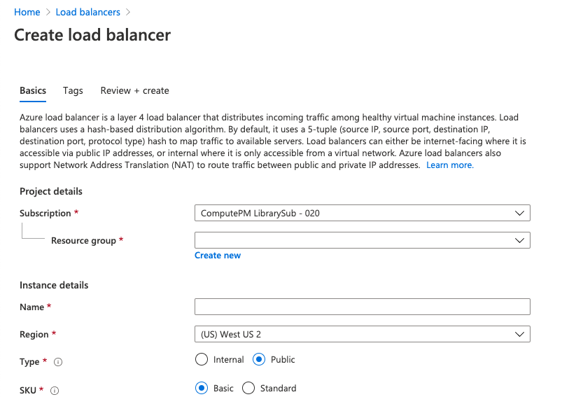
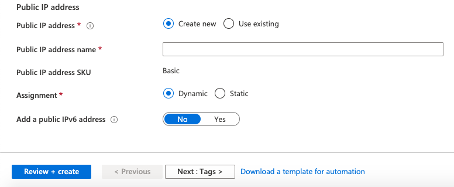
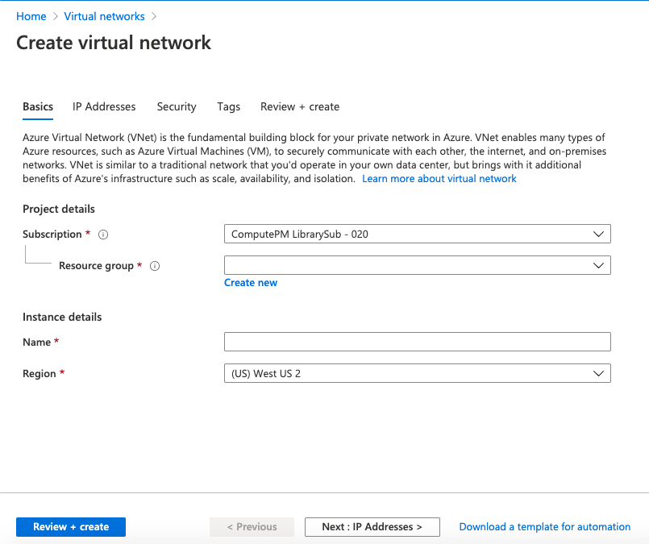
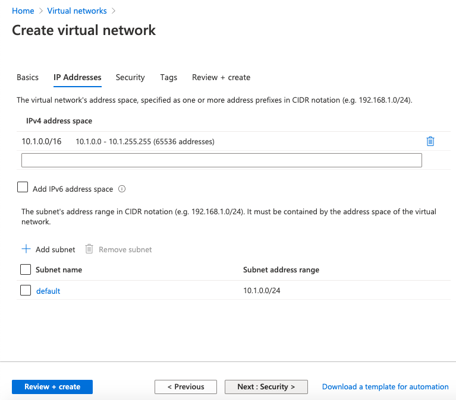
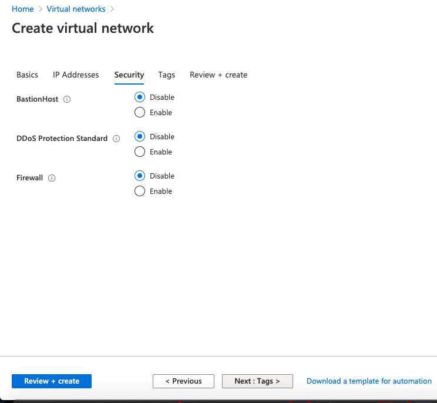
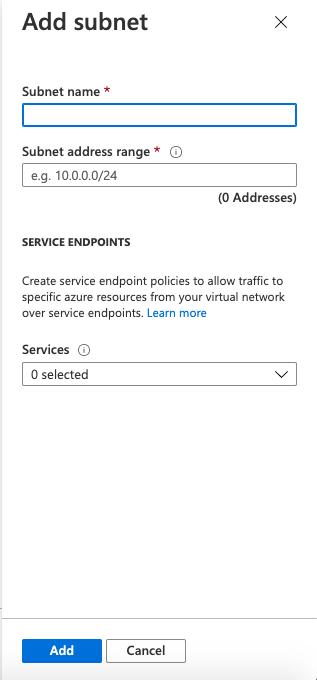
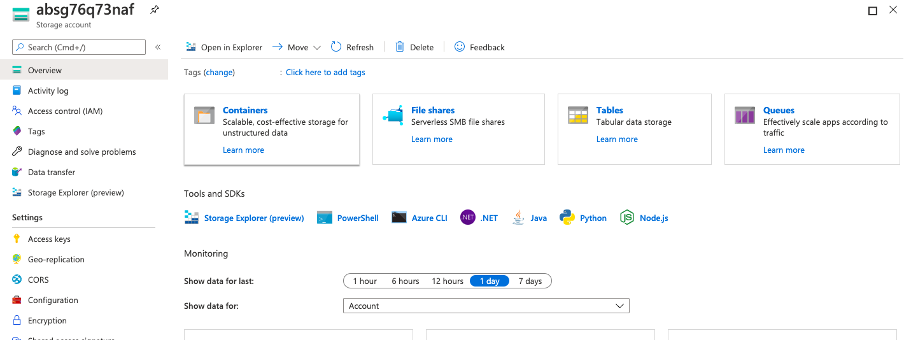

## Moodle Manual  Migration
This document explains how to migrate Moodle from OnPrem servers to Azure cloud.
## Prerequisites
- Must have access to the OnPrem servers to take backup of Moodle and database/configurations.
- Should have a Azure subscription and the Azure Blob storage created before migration.
- Azure cli should be installed in onprem to use AZCOPY
- This migration activity supports with the following Softwares.
    - Ubuntu 16.04 LTS
    - Nginx web server 1.10.3
    - Apache2 2.4
    - MySQL PaaS 5.6, 5.7 or 8.0 database server
    - PHP 7.2, 7.3, or 7.4
    - Moodle 3.8 & 3.9

## Migration

Moodle Migration involves following steps,
- Data Export from OnPrem to Azure Cloud
- Import data from Azure cloud.
- DB migration.

 Data Export from OnPrem to Azure Cloud
- User must have Azure subscription to create a blob storage.
- To add a subscrition [click here](https://ms.portal.azure.com/#blade/Microsoft_Azure_Billing/SubscriptionsBlade), can select [Pay-As-You-Go](https://azure.microsoft.com/en-in/offers/ms-azr-0003p/).
- After creating the subscription, create a [Resource Group](https://ms.portal.azure.com/#create/Microsoft.ResourceGroup) to host a blob storage.
- Create Azure Blob storage in the Azure subscription 
    - After creating a Resource Group, create a [storage account](https://ms.portal.azure.com/#create/Microsoft.StorageAccount) with AutoKind value as "BlobStorage"

    - Povide the storage account name must be in combination of lowercase and numericals, click on create button as shown above.
    - Blob storage is created, can be used to store the onprem data.
- Install Azure CLI on onprem to copy the data to blob storage.
    - Install Azure CLI 
        ```
        curl -sL https://aka.ms/InstallAzureCLIDeb | sudo bash
        ```
    - Now login into your Azure account
        ```
            az login
        ```
    - If the CLI can open your default browser, it will do so and load an Azure sign-in page.
    - Otherwise, open a browser page at https://aka.ms/devicelogin and enter the authorization code displayed in your terminal.
    - Sign in with your account credentials in the browser.
    - Sign in with credentials on the command line
        ```
            az login -u <username> -p <password>
        ```
- Take backup of onprem data such as moodle, moodledata, configurations and database backup file to a folder
- Moodle and Moodledata
    - Moodle folder consists of site HTML content and Moodledata contains Moodle site data
- Configurations
    - Copy the php configurations files such as php-fpm.conf, php.ini, pool.d and conf.d folder to phpconfig folder under the configuration folder.
    - copy the ngnix or apache configuration such as nginx.conf, sites-enabled/dns.conf to the nginxconfig folder under the configuration folder
- create a backup of database 
    - Before taking backup of database onprem should have mysql-server to be installed.
        ```
            sudo -s
            sudo apt install mysql-server
            mysql -u dbUserName -p
            # After the above command user will prompted for database password
            mysqldump -h dbServerName -u dbUserId -pdbPassword dbName > /path/to/location/database.sql
            # Replace dbServerName, dbUserId, dbPassword and bdName with onPrem database details
        ```
- Create an archive tar.gz file of backup folder
    ```
        tar -zcvf storage.tar.gz <source/folder/name>
    ```
- Copy the onprem backup data file to blob storage by following command.
    - To copy use AzCopy user should generate SAS Token.
    - Go to created Storage Account Resource and navigate to Shared access signature in the left pannel.
    - Select the Container checkbox and set the start, expiry date of the SAS token. Click on "Generate SAS and Connection String". 
    - copy the SAS token for further use.
        ```
            az storage container create --account-name <storageAccontName> --name <containerName> --sas-token <SAS_token>
            sudo azcopy copy '/path/to/location/storage.tar' 'https://<storageAccountName>.blob.core.windows.net/<containerName>/<dns>/<SAStoken>
        ```
    - With the above steps onprem data is compressed and exported to Azure blob storage.
    - Import the data from Azure blob storage to VM to migrate.
- Create Azure Blob storage in the Azure subscription and create below folders, - moodle -      moodledata - configurations - dbbackup
- Make a tar file of the Moodle folder. Ex: /moodle
- Make a tar file of the Moodle data folder. Ex: /moodledata
- Make a tar file of php, nginx & moodle configurations. Ex: config.tar.gz
- Take the back of the MySQL DB.
- Use AZCopy to copy above backup files to respective folders in Azure Blob storage.
- Import data to Azure cloud
### Option 2: Migrating Moodle without template 

 * This option is to create the infrastructure manually in azure and migrate Moodle on it. 
 * The Azure infrastructure is the basic skeleton of the resources which will host the Moodle application. 
 * For installing the infrastructure for Moodle navigate to the [azure portal](portal.azure.com) 
 * In the home section go the resource group section and add a new a resource group for the Moodle infrastructure [click here](https://ms.portal.azure.com/#blade/HubsExtension/BrowseResourceGroups) 
  
* Select the default subscription, give the resource group name and select the region for deployment
* Note: The subscription and region will be default creating every resources 
* Add the tag for more specification 
* Tags are name-value pairs that are used to organize resources in Azure Portal [click here](https://docs.microsoft.com/en-us/azure/azure-resource-manager/management/tag-resources) 
 * Click on review and create for creating a resource group 
 * Once resource group is created navigate to it and start create resources into it. 

- ##### Below are the prerequisites resource to host the Moodle application 
- **Network Resources**
    * **Standard Load Balancer:**  An Azure load balancer is a Layer-4 (TCP, UDP) load balancer that provides high availability by distributing incoming traffic among healthy VMs. A load balancer health probe monitors a given port on each VM and only distributes traffic to an operational VM. [click here](https://docs.microsoft.com/en-us/azure/load-balancer/tutorial-load-balancer-standard-internal-portal) 
    *   
    *  In the Basics tab, Select the default subscription and same resource created in above step, give the instance details such as name for load balancer, and default region. 
    *  Select the type as public and sku as standard. 
       -  A public load balancer can provide outbound connections for virtual machines (VMs) inside your virtual network. These connections are accomplished by translating their private IP addresses to public IP addresses. Public Load Balancers are used to load balance internet traffic to your VMs.
       - Standard tier can scale out to 1000 instances and Standard tier can scale out to 1000 instances 
    *  For Public IP address section ,Create a new IP address and give the IP address name and keep other parameters as default.
    *  Click next to tag section, if required give the tag value for more clarification. 
    *  After giving the mandatory values click on review and create. [Click here](https://docs.microsoft.com/en-us/azure/load-balancer/load-balancer-overview) 

    - **Virtual Network** - An Azure Virtual Network is a representation of your own network in the cloud. It is a logical isolation of the Azure cloud dedicated to your subscription. When you create a VNet, your services and VMs within your VNet can communicate directly and securely with each other in the cloud. More information on Virtual Network [click here](https://docs.microsoft.com/en-us/azure/virtual-network/virtual-networks-overview). 
        
    - Navigate to the resource group, select Create a resource. From the Azure Marketplace, select Networking > Virtual network.
    - In Create virtual network, for Basics section provide this information: 
        - Subscription: Select the default subscription. 
        - Resource Group: Select same resource group. 
        - Name: Give the instance name. 
        - Region: Select default region. 
    - Select Next: IP Addresses, and for IPv4 address space, enter 10.1.0.0/16. 
    - Select Add subnet, then enter Subnet name and 10.1.0.0/24 for Subnet address range.
        
    - Select Add, then select Review + create. Leave the rest parameters as default and select Create.
    - For more Details [click here](https://docs.microsoft.com/en-us/azure/virtual-network/quick-create-portal)
    
- **Storage Resources**
    * An Azure storage account contains all of your Azure Storage data objects: blobs, files, queues, tables, and disks. The storage account provides a unique namespace for your Azure Storage data that is accessible from anywhere in the world over HTTP or HTTPS
    * Storage account will have specific type, replication, Performance, Size.Below are some examples. [click here](https://docs.microsoft.com/en-us/azure/storage/common/storage-account-overview).
     *  The types of storage accounts are:
        - General-purpose V2- It is Basic storage account type for blobs, files, queues, and tables and recommended for most scenarios using Azure Storage
        - General-purpose V1- It is Legacy account type for blobs, files, queues, and tables somecan can use  general-purpose v2 accounts instead when possible.
        - BlockBlobStorage- Storage accounts with premium performance characteristics for block blobs and append blobs. Recommended for scenarios with high transactions rates, or scenarios that use smaller objects or require consistently low storage latency.
        - File Storage- Files-only storage accounts with premium performance characteristics. Recommended for enterprise or high performance scale applications.
        - BlobStorage accounts- Legacy Blob-only storage accounts. Use general-purpose v2 accounts instead when possible.
    - Replication:
        - Locally-redundant storage (LRS)- A simple, low-cost redundancy strategy. Data is copied synchronously three times within the primary region.
        - Zone-redundant storage (ZRS)-  Redundancy for scenarios requiring high availability. Data is copied synchronously across three Azure availability zones in the primary region.
        - Geo redundant storage (GRS)- Cross-regional redundancy to protect against regional outages. Data is copied synchronously three times in the primary region, then copied asynchronously to the secondary region. For read access to data in the secondary region, enable read-access geo-redundant storage (RA-GRS).
    - Performance: 
        - Standard- A standard performance tier for storing blobs, files, tables, queues, and Azure virtual machine disks.
        - Premium- A premium performance tier for storing unmanaged virtual machine disks.
    - Size(sku):  A single storage account can store up to 500 TB of data and like any other Azure service
    - For creating a storage account navigate to the resource group and search resource storage account.
    - On the Storage Accounts window that appears, choose Add. 
    - Select the default subscription in which to create the storage account. 
    - Under the Resource group field, select the default resource group 
    - Next, give the name for  storage account. The name you choose must be unique across Azure. The name also must be between 3 and 24 characters in length, can include numbers and lowercase letters only. 
    - Select a default region for storage account.
    - Keep the Deployment model default as Resource Manager 
    - Choose the performance as standard or premium 
    - Choose the Acount kind as per choice such as General-purpose V1 or General-purpose V2 
    - Choose any of the replication such as LRS,GRS,etc.
    - Choose the access tier for the same
    - Azure storage offers different access tiers, which allow you to store blob object data in the most cost-effective manner. The available access tiers include: Hot - Optimized for storing data that is accessed frequently. Cool - Optimized for storing data that is infrequently accessed and stored for at least 30 days
    - Leave the others tabs as default.
    - If you plan to use [Azure Data Lake Storage](https://azure.microsoft.com/services/storage/data-lake-storage/), choose the Advanced tab, and then set Hierarchical namespace to Enabled.
    - Select Review + Create to review your storage account settings and create the account. 
    - Select Create. [Click here](https://docs.microsoft.com/en-us/azure/storage/common/storage-account-create?tabs=azure-portal)
    - For more information about types of storage accounts and other storage account settings, see [Azure storage account overview](https://docs.microsoft.com/en-us/azure/storage/common/storage-account-overview). For more information on resource groups, see [Azure Resource Manager overview](https://docs.microsoft.com/en-us/azure/azure-resource-manager/resource-group-overview). 
    - For NFS and glusterFS:  
        - Replication is standard Locally-redundant storage (LRS)  
        - Type is Storage (general purpose v1) 
    - Azure Files: 
        - Replication is Premium Locally-redundant storage (LRS)  
        - Type is File Storage  
    - These storage mechanisms will differ according to storage type such as 
        - NFS and glusterFS will create a container 
        - Azure files will create a file share. 
    - To access the containers and file share etc. navigate to storage account in resource group in the portal. 
     

  
- **Database Resources** - 
    - Creates an Azure Database for MySQL server. [click here](https://docs.microsoft.com/en-in/azure/mysql/).
    - Azure Database for MySQL is easy to set up, manage and scale. It automates the management and maintenance of your infrastructure and database server, including routine updates,backups and security. Build with the latest community edition of MySQL, including versions 5.6, 5.7 and 8.0.
    - 
    - Select the Create a resource button (+) in the upper left corner of the portal in resource group
    - Select Databases > Azure Database for MySQL. If you cannot find MySQL Server under the Databases category, click See all to show all available database services. You can also type Azure Database for MySQL in the search box to quickly find the service. 
    - Click Azure Database for MySQL tile. Fill out the Azure Database for MySQL form. 
        - Server name: Choose a unique name that identifies your Azure Database for MySQL server. For example, mydemoserver. The domain name.mysql.database.azure.com is appended to the server name you provide. The server name can contain only lowercase letters, numbers, and the hyphen (-) character. It must contain from 3 to 63 characters. 
        - Subscription: Select the default subscription.
        - Resource group: The resource group will be auto selected. 
        - Select source: Select Blank to create a new server from scratch. (You select Backup if you are creating a server from a geo-backup of an existing Azure Database for MySQL server). 
        - Server admin login: Give a sign in name to use when you're connecting to the server. The admin sign-in name cannot be azure_superuser, admin, administrator, root, guest, or public. 
        - Password: Provide a new password for the server admin account. It must contain from 8 to 128 characters. Your password must contain characters from three of the following categories: English uppercase letters, English lowercase letters, numbers (0-9), and non-alphanumeric characters (!, $, #, %, and so on). 
        - Confirm password: Confirm the admin account password. 
        - Location: Select the default region.
        - Version: Select the latest version (unless you have specific requirements that require another version). 
        - Pricing tire: General Purpose, Gen 5, 2 vCores, 5 GB, 7 days, Geographically Redundant. 
        - The compute, storage, and backup configurations for your new server. Select Pricing tier
        - Next, select the General-Purpose tab. Gen 5, 2 vCores, 5 GB, and 7 days are the default values for Compute Generation, vCore, Storage, and Backup Retention Period. You can leave those sliders as is. To enable your server backups in geo-redundant storage, select Geographically Redundant from the Backup Redundancy Options. To save this pricing tier selection, select OK. The next screenshot captures these selections.
        
        - Click on review and create for creating a storage account
    - **Configure firewall:**
    -  Azure Databases for MySQL are protected by a firewall. By default, all connections to the server and the databases inside the server are rejected. Before connecting to Azure Database for MySQL for the first time, configure the firewall to add the client machine's public network IP address (or IP address range). 
    -  Click your newly created  MySQL server, and then click Connection security. 
    -  
    -  You can Add My IP, or configure firewall rules here.click Save after you have created the rules. You can now connect to the server using mysql command-line tool or MySQL Workbench GUI tool. 
-  **Get connection information:**
    -  From the MySQL server resource page, note down Server Name and Server admin login name. You may click the copy button next to each field to copy to the clipboard.
    -  
    -  For example, the server name is mydemoserver.mysql.database.azure.com, and the server admin login is myadmin@mydemoserver.
    
-  **Virtual Machine** 
    -  A virtual machine is a computer file, typically called an image, which behaves like an actual compute [click here](https://azure.microsoft.com/en-in/overview/what-is-a-virtual-machine/). 
    -  Before creating Virtual machine create an SSH key pair.
        -  If you already have an SSH key pair, you can skip this step. 
        -  Go to the PuTTY installation folder (the default location is C:\Program Files\PuTTY) and run: puttygen.exe 
        -  In the PuTTY Key Generator window, set Type of key to generate to RSA, and set Number of bits in a generated key to 2048. 
        -  ![putty keygen SS]
        -  Select Generate.
        -  To generate a key, in the Key box, move the pointer randomly. 
        -  When the key generation has finished, select Save public key, and then select Save private key to save your keys to files. 
        -  
        -  The public and private key is generated.
    -  Create a VM with ubuntu 16.04 / 18.04 operating system with SSH public key 
    -  Select the default subscription and same resource group and give name for virtual machine. 
    -  Give the default region group. 
    -  Keep the availability options as default. 
    -  Image is the size of the virtual machine. Browse the image and select it.
    -  Select Authentication type SSH, give the username give the SSH key generated in previous step. 
    -  Select the disk size. 
    -  Select the inbound rule for SSH as 22 and HTTP as 80.
    -  
    -  Click next on Disk section.
    -  Select the OS disk type. There are 3 choices Standard SSD, Premium SSD, Standard HDD 
    -  Keep the other parameters as default. 
    -  
    -  Click next on networking and select the virtual network created in above step and the public IP and keep the above parameters as default.
    -  
    -  Click on next for management and keep the parameters as default. 
    -   
    -   Keeping the other parameters as default Click on review and create.
    -   Login into this controller machine using any of the free open-source terminal emulator or serial console tools.
    -   Copy the public IP of controller VM and paste as host name and expand SSH in navigation panel and click on Auth and browse the same SSH key file given while deployment. Click on Open and it will prompt to give the username as azureadmin same as given while deployment that is azureadmin 
    -   
    -   
    -   ##### Download and execute a moodle script
    -   Download install_prerequisites.sh script.
        ```
            cd /home/azureadmin/
            wget 
        ```
    -   Run the install_prerequisites.sh script
        ```
            bash install_prerequisites.sh
        ```
    -   Above script will perform following task
        -   Install web server (nginx/apache)
        -   Install PHP with its extensions
        -   Create a moodle shared folder (/moodle)
    -   Download and run the migrate_moodle.sh script
        ```
            cd /home/azureadmin/
            wget 
            bash migrate_moodle.sh
        ```
    - This script will install empty moodle instance 
    - Download the onprem compressed data from Azure Blob storage to VM such as Moodle, Moodledata, configuration folders with database backup file to /home/azureadmin location
     - Replace the moodle folder  
        - Download moodle.tar.gz file from the blob storage. The path to download will be /home/azureadmin. Navigate to this path 
        
            ```
                cd /home/azureadmin 
                azcopy copy 'https://storageaccount.blob.core.windows.net/container/BlobDirectory/*' 'Path/to/folder' 
            ```
        - After downloading the moodle.tar.gz ,extract moodle.tar.gz file  
            ```
                tar -zxvf yourfile.tar.gz
            ``` 
        - Then copy and replace this moodle folder with existing folder 
        - Before accessing the moodle folder switch to root user and copy the moodle folder to existing path 
            ```
                cp /home/azureadmin/moodle /moodle/html
         ```
    * Replace the moodledata folder  
        -  Download moodledata.tar.gz file from the blob storage.
        - Navigate to the path 
            
            ```
                cd /home/azureadmin
                azcopy copy 'https://storageaccount.blob.core.windows.net/container/BlobDirectory/*' 'Path/to/folder'
            ``` 
        - After downloading the moodledata.tar.gz ,extract this moodledata.tar.gz file
            ``` 
                tar -zxvf yourfile.tar.gz
            ``` 
        
        - Then copy and replace this moodledata (/moodle/moodledata) folder with existing folder 
        - Go as a root user and copy the moodledata folder existing path 
            ```
                cp /home/azureadmin/moodledata /moodle/
            ``` 
    -   Set the configuration
    -   Set the Moodle and Moodledata folder permissions.
    -   Set 755 and www-data owner:group permissions to Moodle folder
        ```sh
        sudo chmod 755 /moodle
        sudo chown -R www-data:www-data /moodle 
        ```
    -   Set 770 and www-data owner:group permissions to MoodleData folder
        ```
        sudo chmod 755 /moodle/moodledata
        sudo chown -R www-data:www-data /moodle/moodledata
        ```
    -  Importing the .sql file  
        -   Download the database.tar.gz from the blob storage
        -   The path to download will be /home/azureadmin so navigate to this path
        ```
            cd /home/azureadmin 
            azcopy copy 'https://storageaccount.blob.core.windows.net/container/BlobDirectory/*' 'Path/to/folder' 
        ```
        - After downloading the database.tar.gz file will be present
        - Extract this database.tar.gz file
        ```
            tar -zxvf yourfile.tar.gz
        ```
        - The database folder will be extracted which contains the .sql file. 
        - Go as a root user and navigate to database folder and import the .sql file. - For database import first create a database.
        ```
            mysql -h $server_name -u $ server_admin_login_name -p$admin_password -e "CREATE DATABASE ${moodledbname} CHARACTER SET utf8;"
        ```
    - Change the permissions.
        ```
            mysql -h $ server_name -u $ server_admin_login_name -p${admin_password } -e "GRANT ALL ON ${moodledbname}. * TO ${moodledbuser} IDENTIFIED BY '${moodledbpass}';" 
        ```
    - Import the database into it.
        ```
            mysql -h db_server_name -u db_login_name -pdb_pass dbname >/path/to/.sql file 
        ```
    - Set 755 and www-data owner:group permissions to Moodle folder.
        ```
            sudo chmod 755 /moodle
            sudo chown -R www-data:www-data /moodle 
        ```
    - Set 770 and www-data owner:group permissions to MoodleData folder
        ```
            sudo chmod 755 /moodle/moodledata
            sudo chown -R www-data:www-data /moodle/moodledata 
        ```
    - Modify the Moodle configuration 
    - Download the configuration.tar.gz from the blob storage.
    - The path to download will be /home/azureadmin
        ```
            cd /home/azureadmin 
            azcopy copy 'https://storageaccount.blob.core.windows.net/container/BlobDirectory/*' 'Path/to/folder' 
        ```
    - After downloading the configuration.tar.gz file will be present.
    - Extract this d configuration.tar.gz file
        ```
            tar -zxvf yourfile.tar.gz
        ```
    - The configuration folder will be extracted with nginx and php configuration files.
    - For changing nginx configuration.
        - First change the database details in moodle configuration file (/moodle/config.php)
        - Go to root user and copy the nginx configuration file
        ```
            mkdir  -p /home/azureadmin/backup/
            sudo mv /etc/nginx/sites-enabled/<dns>.conf  /home/azureadmin/backup/ 
            cd /home/azureadmin/storage/configuration/
            sudo cp <dns>.conf  /etc/nginx/sites-enabled/ 
        ```
        - Change the log paths and mention the example
        - DNS name and certs and its path.
    - copy the php config file from blob storage to the php config folder. 
        ```
            sudo mv /etc/php/<phpVersion>/fpm/pool.d/www.conf /home/azureadmin/backup 
            sudo  cp /home/azureadmin/storage/configuration/www.conf /etc/php/<phpVersion>/fpm/pool.d/ 
            sudo systemctl restart nginx 
            sudo systemctl restart php(phpVersion)-fpm  
            ex: sudo systemctl restart php7.4-fpm  
        ```
- **Scale Set:** 
    - A virtual machine scale set allows you to deploy and manage a set of auto-scaling virtual machines. You can scale the number of VMs in the scale set manually, or define rules to auto scale based on resource usage like CPU, memory demand, or network traffic. An Azure load balancer then distributes traffic to the VM instances in the scale set. [Click here](https://docs.microsoft.com/en-us/azure/virtual-machine-scale-sets/quick-create-portal) 
        - Create a scale set in same resource group.
        - Prerequisites is the to create a public Standard Load Balancer. 
        - The name and public IP address created are automatically configured as the load balancer's front end. 
        - You can deploy a scale set with a Windows Server image or Linux image such as RHEL, CentOS, Ubuntu, or SLES. 
        - Search Virtual machine scale sets. Select Create on the Virtual machine scale sets page, which will open the Create a virtual machine scale set page. 
        - In the Basics tab, under Project details, select the subscription and then choose to same resource. 
        - Type name as the name for your scale set. 
        - In Region, select the same region. 
        - Leave the default value of Scale Set VMs for Orchestration mode. 
        - Enter your desired username, and select which authentication type as SSH and give the same SSH key and username as azureadmin.
        - 
        - Select the image or browse the image for the scale set 
        - Select the size for the disk. 
        - Select the authentication type as SSH and provide the same username as azureadmin and SSH key 
        - Click Next for the disk tab select the OS disk type as per choice 
        - 
        - Click Next for the networking section 
        - 
        - Select the same virtual network as selected for virtual machine. 
        - 
        - Give the instance count and the scaling policy as manual or custom. 
        - Select Next and keep the other things as default. 
        - Click on review and create and the scale set. 
        - 
        - Execute the webserver.sh script in the VMSS extension 
        - Install webserver apache/nginx 
        - Install php with extensions 
        - Modify the Moodle, nginx, PHP configuration with on-prem. 
        - Change the database details in moodle configuration file (/moodle/config.php) 
        - Download and Copy the nginx config file from blob storage to the nginx config folder. 
        - Download and Copy the php config file from blob storage to the php config folder. 
        - Create a local copy of moodle from shared folder 
    - Set a cron job to copy the shared moodle content to /var/www/html/ folder whenever there is a change in timestamp in shared folder. 
    - Restart servers 
    - Restart nginx server 
    - Restart php-fpm server 
    - With the above steps Moodle infrastructure is ready 
    - User now hit the load balancer DNS name to get the migrated moodle web page. 
    
